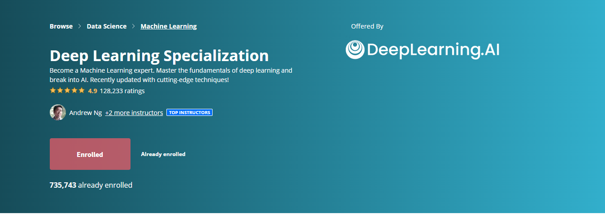

# Deep Learning Specialization Coursera

[Deep Learning Specialization](https://www.coursera.org/specializations/deep-learning) is a foundational program for gaining speciality on deep learning in order to develop cutting-edge AI technologies. Course is offered by [DeepLearning.AI](https://www.deeplearning.ai/) on Coursera. 

Instructor: [Andrew Ng](http://www.andrewng.org/)

## Course 1: [Neural Networks and Deep Learning](https://www.coursera.org/learn/neural-networks-deep-learning?specialization=deep-learning) 

### [Content](https://github.com/ahsan-83/Deep-Learning-Specialization-Coursera/tree/main/Neural%20Networks%20and%20Deep%20Learning)

### Coursework
- Deep Learning
- Artificial Neural Network
- Backpropagation
- Python Programming
- Neural Network Architecture

### [Course Details](https://github.com/ahsan-83/Deep-Learning-Specialization-Coursera/blob/main/Neural%20Networks%20and%20Deep%20Learning/Certificate/Course%20Info.pdf)

### Lectures
- [Week 1-Introduction to Deep Learning](https://github.dev/ahsan-83/Deep-Learning-Specialization-Coursera/blob/main/Neural%20Networks%20and%20Deep%20Learning/Lectures/C1_W1.pdf)
- [Week 2-Neural Networks Basics](https://github.com/ahsan-83/Deep-Learning-Specialization-Coursera/blob/main/Neural%20Networks%20and%20Deep%20Learning/Lectures/C1_W2.pdf)
- [Week 3-Shallow Neural Networks](https://github.com/ahsan-83/Deep-Learning-Specialization-Coursera/blob/main/Neural%20Networks%20and%20Deep%20Learning/Lectures/C1_W3.pdf)
- [Week 4-Deep Neural Networks](https://github.com/ahsan-83/Deep-Learning-Specialization-Coursera/blob/main/Neural%20Networks%20and%20Deep%20Learning/Lectures/C1_W4.pdf)

### Assignment 
- [Week 2-Programming Assignment Python Basics with numpy](https://github.com/ahsan-83/Deep-Learning-Specialization-Coursera/blob/091901143797354484ecea3192b61b1dc0e6a58c/Neural%20Networks%20and%20Deep%20Learning/Assignment/Week%202-Programming%20Assignment%20Python%20Basics%20with%20numpy/Python_Basics_With_Numpy_v3a.ipynb)
- [Week 2-Programming Assignment Logistic Regression with a Neural Network mindset](https://github.com/ahsan-83/Deep-Learning-Specialization-Coursera/blob/main/Neural%20Networks%20and%20Deep%20Learning/Assignment/Week%202-Programming%20Assignment%20Logistic%20Regression%20with%20a%20Neural%20Network%20mindset/Logistic_Regression_with_a_Neural_Network_mindset_v6a.ipynb)
- [Week 3-Programming Assignment Planar data classification](https://github.com/ahsan-83/Deep-Learning-Specialization-Coursera/blob/main/Neural%20Networks%20and%20Deep%20Learning/Assignment/Week%203-Programming%20Assignment%20Planar%20data%20classification/Planar_data_classification_with_onehidden_layer_v6c.ipynb)
- [Week 4-Programming Assignment Building your deep neural network Step by Step](https://github.com/ahsan-83/Deep-Learning-Specialization-Coursera/blob/main/Neural%20Networks%20and%20Deep%20Learning/Assignment/Week%204-Programming%20Assignment%20Building%20your%20deep%20neural%20network%20Step%20by%20Step/Building_your_Deep_Neural_Network_Step_by_Step_v8a.ipynb)
- [Week 4-Programming Assignment Deep Neural Network Application](https://github.com/ahsan-83/Deep-Learning-Specialization-Coursera/blob/main/Neural%20Networks%20and%20Deep%20Learning/Assignment/Week%204-Programming%20Assignment%20Deep%20Neural%20Network%20Application/Deep%2BNeural%2BNetwork%2B-%2BApplication%2Bv8.ipynb)

### Quizes
- [Week 1-Introduction to deep learning](https://github.com/ahsan-83/Deep-Learning-Specialization-Coursera/blob/main/Neural%20Networks%20and%20Deep%20Learning/Quizes/Week%201-Introduction%20to%20deep%20learning.pdf)
- [Week 2-Neural Network Basics](https://github.com/ahsan-83/Deep-Learning-Specialization-Coursera/blob/main/Neural%20Networks%20and%20Deep%20Learning/Quizes/Week%202-Neural%20Network%20Basics.pdf)
- [Week 3-Shallow Neural Networks](https://github.com/ahsan-83/Deep-Learning-Specialization-Coursera/blob/main/Neural%20Networks%20and%20Deep%20Learning/Quizes/Week%203-Shallow%20Neural%20Networks.pdf)
- [Week 4-Key concepts on Deep Neural Networks](https://github.com/ahsan-83/Deep-Learning-Specialization-Coursera/blob/main/Neural%20Networks%20and%20Deep%20Learning/Quizes/Week%204-Key%20concepts%20on%20Deep%20Neural%20Networks.pdf)

### [Grades](https://github.com/ahsan-83/Deep-Learning-Specialization-Coursera/blob/main/Neural%20Networks%20and%20Deep%20Learning/Certificate/Grades.pdf)
### [Certificate](https://www.coursera.org/account/accomplishments/verify/2ZGBA3L6AZ5Q)

## Course 2: [Improving Deep Neural Networks](https://www.coursera.org/learn/deep-neural-network?specialization=deep-learning)

### [Content](https://github.com/ahsan-83/Deep-Learning-Specialization-Coursera/tree/main/Improving%20Deep%20Neural%20Network)

### Coursework
- Tensorflow
- Deep Learning
- Mathematical Optimization
- Hyperparameter tuning

### Lectures
- [Week 1-Practical Aspects of Deep Learning](https://github.com/ahsan-83/Deep-Learning-Specialization-Coursera/blob/main/Improving%20Deep%20Neural%20Network/Lectures/C2_W1.pdf)
- [Week 2-Optimization Algorithms](https://github.com/ahsan-83/Deep-Learning-Specialization-Coursera/blob/main/Improving%20Deep%20Neural%20Network/Lectures/C2_W2.pdf)
- [Week 3-Hyperparameter Tuning, Batch Normalization and Programming Frameworks](https://github.com/ahsan-83/Deep-Learning-Specialization-Coursera/blob/main/Improving%20Deep%20Neural%20Network/Lectures/C2_W3.pdf)

### Assignment 
- [Week 1-Programming Assignment Initialization](https://github.com/ahsan-83/Deep-Learning-Specialization-Coursera/blob/main/Improving%20Deep%20Neural%20Network/Assignment/Week%201-Programming%20Assignment%20Initialization/Initialization.ipynb)
- [Week 1-Programming Assignment Gradient Checking](https://github.com/ahsan-83/Deep-Learning-Specialization-Coursera/blob/main/Improving%20Deep%20Neural%20Network/Assignment/Week%201-Programming%20Assignment%20Gradient%20Checking/Gradient_Checking.ipynb)
- [Week 1-Programming Assignment Regularization](https://github.com/ahsan-83/Deep-Learning-Specialization-Coursera/blob/main/Improving%20Deep%20Neural%20Network/Assignment/Week%201-Programming%20Assignment%20Regularization/Regularization.ipynb)
- [Week 2-Programming Assignment Optimization Methods](https://github.com/ahsan-83/Deep-Learning-Specialization-Coursera/blob/main/Improving%20Deep%20Neural%20Network/Assignment/Week%202-Programming%20Assignment%20Optimization%20Methods/Optimization_methods.ipynb)
- [Week 3-Programming Assignment TensorFlow Introduction](https://github.com/ahsan-83/Deep-Learning-Specialization-Coursera/blob/main/Improving%20Deep%20Neural%20Network/Assignment/Week%203-Programming%20Assignment%20TensorFlow%20Introduction/Tensorflow_introduction.ipynb)

### Quizes
- [Week 1-Practical aspects of Deep Learning](https://github.com/ahsan-83/Deep-Learning-Specialization-Coursera/blob/main/Improving%20Deep%20Neural%20Network/Quizes/Week%201-Practical%20aspects%20of%20Deep%20Learning.pdf)
- [Week 2-Optimization Algorithms](https://github.com/ahsan-83/Deep-Learning-Specialization-Coursera/blob/main/Improving%20Deep%20Neural%20Network/Quizes/Week%202-Optimization%20Algorithms.pdf)
- [Week 3-Hyperparameter tuning](https://github.com/ahsan-83/Deep-Learning-Specialization-Coursera/blob/main/Improving%20Deep%20Neural%20Network/Quizes/Week%203-Hyperparameter%20tuning.pdf)

### [Grades](https://github.com/ahsan-83/Deep-Learning-Specialization-Coursera/blob/main/Improving%20Deep%20Neural%20Network/Certificate/Grades.pdf)
### [Certificate](https://www.coursera.org/account/accomplishments/verify/9FW94ZAYVCSZ)

## Course 3: [Structuring Machine Learning Projects](https://www.coursera.org/learn/machine-learning-projects?specialization=deep-learning)

### [Content](https://github.com/ahsan-83/Deep-Learning-Specialization-Coursera/tree/main/Structuring%20Deep%20Learning%20Project)

### Coursework
- Deep Learning
- Inductive Transfer
- Machine Learning
- Multi-Task Learning
- Decision-Making

### Lectures
- [Week 1-ML Strategy](https://github.com/ahsan-83/Deep-Learning-Specialization-Coursera/blob/main/Structuring%20Deep%20Learning%20Project/Lectures/C3_W1.pdf)
- [Week 2-ML Strategy](https://github.com/ahsan-83/Deep-Learning-Specialization-Coursera/blob/main/Structuring%20Deep%20Learning%20Project/Lectures/C3_W2.pdf)

### Quizes
- [Week 1-Bird Recognition in the City of Peacetopia (Case Study)](https://github.com/ahsan-83/Deep-Learning-Specialization-Coursera/blob/main/Structuring%20Deep%20Learning%20Project/Quizes/Week%201-Bird%20Recognition%20in%20the%20City%20of%20Peacetopia%20(Case%20Study).pdf)
- [Week 2-Autonomous Driving (Case Study)](https://github.com/ahsan-83/Deep-Learning-Specialization-Coursera/blob/main/Structuring%20Deep%20Learning%20Project/Quizes/Week%202-Autonomous%20Driving%20(Case%20Study).pdf)

### [Grades](https://github.com/ahsan-83/Deep-Learning-Specialization-Coursera/blob/main/Structuring%20Deep%20Learning%20Project/Certificate/Grades.pdf)
### [Certificate](https://www.coursera.org/account/accomplishments/verify/BZE6J6RT4NNJ)

## Course 4: [Convolutional Neural Networks](https://www.coursera.org/learn/convolutional-neural-networks?specialization=deep-learning)

### [Content](https://github.com/ahsan-83/Deep-Learning-Specialization-Coursera/tree/main/Convolutional%20Neural%20Networks)

### Coursework
- Deep Learning
- Facial Recognition System
- Convolutional Neural Network
- Tensorflow
- Object Detection and Segmentation

### Lectures
- [Week 1-Foundations of Convolutional Neural Networks](https://github.com/ahsan-83/Deep-Learning-Specialization-Coursera/blob/main/Convolutional%20Neural%20Networks/Lectures/C4_W1.pdf)
- [Week 2-Deep Convolutional Models: Case Studies](https://github.com/ahsan-83/Deep-Learning-Specialization-Coursera/blob/main/Convolutional%20Neural%20Networks/Lectures/C4_W2.pdf)
- [Week 3-Object Detection](https://github.com/ahsan-83/Deep-Learning-Specialization-Coursera/blob/main/Convolutional%20Neural%20Networks/Lectures/C4_W3.pdf)
- [Week 4-Special Applications: Face recognition & Neural Style Transfer](https://github.com/ahsan-83/Deep-Learning-Specialization-Coursera/blob/main/Convolutional%20Neural%20Networks/Lectures/C4_W4.pdf)

### Assignment 
- [Week 1-Programming Assignment Convolutional Model-Step by Step](https://github.com/ahsan-83/Deep-Learning-Specialization-Coursera/blob/main/Convolutional%20Neural%20Networks/Assignment/Week%201-Programming%20Assignment%20Convolutional%20Model-Step%20by%20Step/Convolution_model_Step_by_Step_v1.ipynb)
- [Week 1-Programming Assignment Convolution Model Application](https://github.com/ahsan-83/Deep-Learning-Specialization-Coursera/blob/main/Convolutional%20Neural%20Networks/Assignment/Week%201-Programming%20Assignment%20Convolution%20Model%20Application/Convolution_model_Application.ipynb)
- [Week 2-Programming Assignment Transfer Learning with MobileNet](https://github.com/ahsan-83/Deep-Learning-Specialization-Coursera/blob/main/Convolutional%20Neural%20Networks/Assignment/Week%202-Programming%20Assignment%20Transfer%20Learning%20with%20MobileNet/Transfer_learning_with_MobileNet_v1.ipynb)
- [Week 2-Programming Assignment Residual Networks](https://github.com/ahsan-83/Deep-Learning-Specialization-Coursera/blob/main/Convolutional%20Neural%20Networks/Assignment/Week%202-Programming%20Assignment%20Residual%20Networks/Residual_Networks.ipynb)
- [Week 3-Programming Assignment Car detection with YOLO](https://github.com/ahsan-83/Deep-Learning-Specialization-Coursera/blob/main/Convolutional%20Neural%20Networks/Assignment/Week%203-Programming%20Assignment%20Car%20detection%20with%20YOLO/Autonomous_driving_application_Car_detection.ipynb)
- [Week 3-Programming Assignment Image Segmentation with U-Net](https://github.com/ahsan-83/Deep-Learning-Specialization-Coursera/blob/main/Convolutional%20Neural%20Networks/Assignment/Week%203-Programming%20Assignment%20Image%20Segmentation%20with%20U-Net/Image_segmentation_Unet_v2.ipynb)
- [Week 4-Programming Assignment Face Recognition](https://github.com/ahsan-83/Deep-Learning-Specialization-Coursera/blob/main/Convolutional%20Neural%20Networks/Assignment/Week%204-Programming%20Assignment%20Face%20Recognition/Face_Recognition.ipynb)
- [Week 4-Programming Assignment Art Generation with Neural Style Transfer](https://github.com/ahsan-83/Deep-Learning-Specialization-Coursera/blob/main/Convolutional%20Neural%20Networks/Assignment/Week%204-Programming%20Assignment%20Art%20Generation%20with%20Neural%20Style%20Transfer/Art_Generation_with_Neural_Style_Transfer.ipynb)

### Quizes
- [Week 1-The Basics of ConvNets](https://github.com/ahsan-83/Deep-Learning-Specialization-Coursera/blob/main/Convolutional%20Neural%20Networks/Quizes/Week%201-The%20Basics%20of%20ConvNets.pdf)
- [Week 2-Deep Convolutional Models](https://github.com/ahsan-83/Deep-Learning-Specialization-Coursera/blob/main/Convolutional%20Neural%20Networks/Quizes/Week%202-Deep%20Convolutional%20Models.pdf)
- [Week 3-Detection Algorithms](https://github.com/ahsan-83/Deep-Learning-Specialization-Coursera/blob/main/Convolutional%20Neural%20Networks/Quizes/Week%203-Detection%20Algorithms.pdf)
- [Week 4-Special Applications Face Recognition & Neural Style Transfer](https://github.com/ahsan-83/Deep-Learning-Specialization-Coursera/blob/main/Convolutional%20Neural%20Networks/Quizes/Week%204-Special%20Applications%20Face%20Recognition%20%26%20Neural%20Style%20Transfer.pdf)

### [Grades](https://github.com/ahsan-83/Deep-Learning-Specialization-Coursera/blob/main/Convolutional%20Neural%20Networks/Certificate/Grades.pdf)
### [Certificate](https://www.coursera.org/account/accomplishments/verify/EUV36NU2MEU7)

